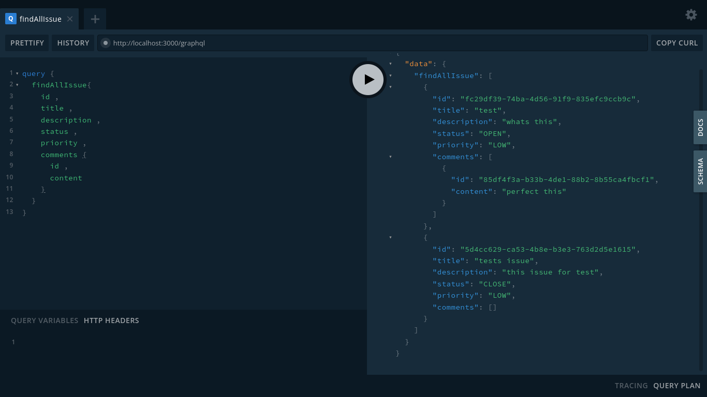
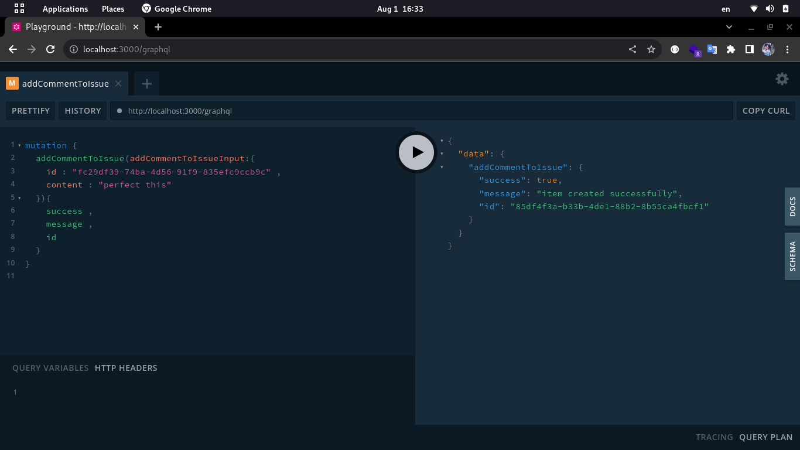
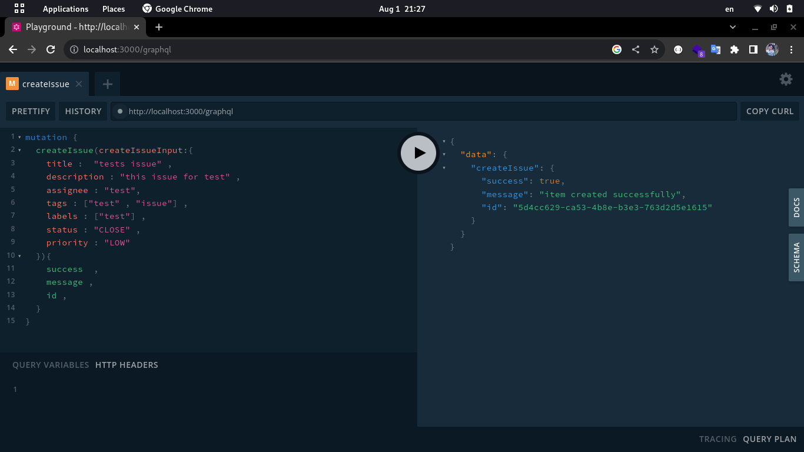
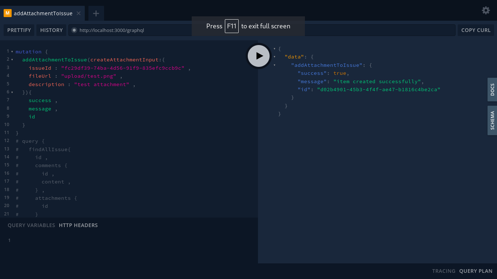
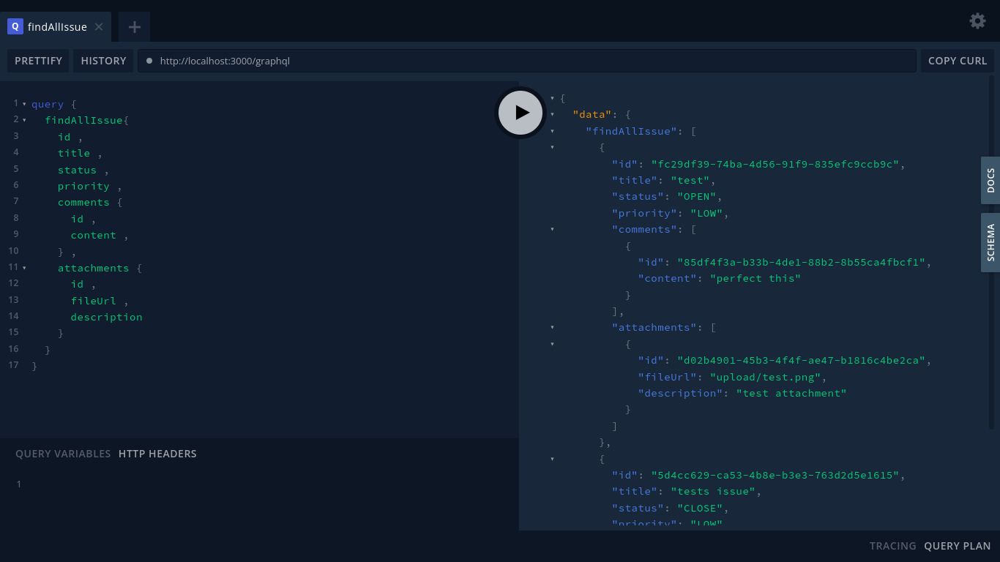
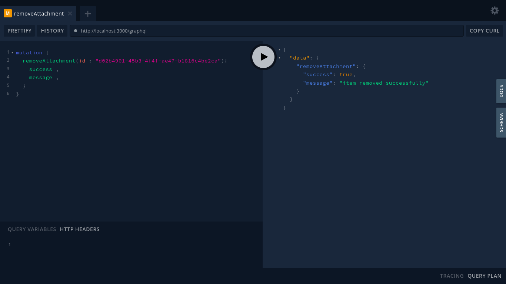
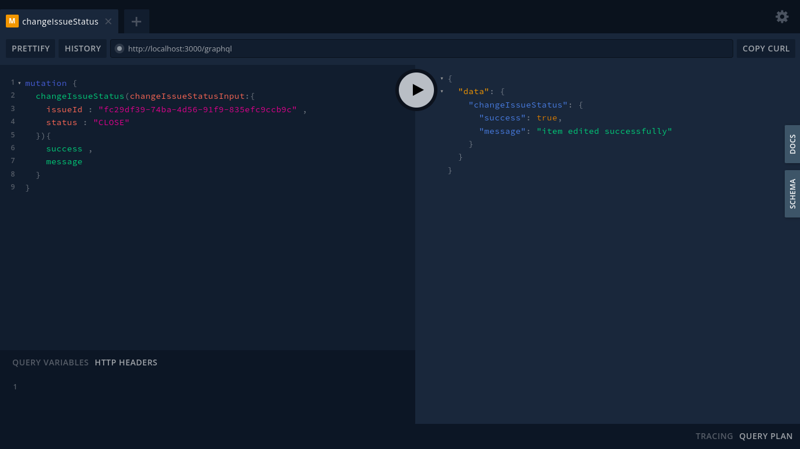
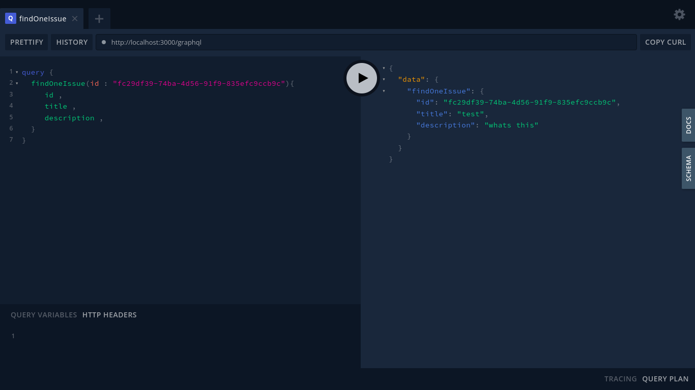

# Issue Tracker - GraphQL API TS

The Issue Tracker GraphQL API is a powerful system for managing software development projects and tracking issues. It allows users to create, update, and manage issues efficiently.

## Demo 


















## Features

- **Create Issue:** Users can create a new issue by providing essential details like title, description, priority, and assignee.
- **Update Issue:** Users can update existing issues by modifying their title, description, priority, status, and assignee.
- **List Issues:** Users can view a list of all issues in the system, sorted by priority or creation date.
- **Search Issues:** Users can search for issues based on keywords, status, priority, or assignee.
- **Assign Issue:** Users can assign an issue to a specific team member for resolution.
- **Change Issue Status:** Users can change the status of an issue (e.g., open, in progress, closed) as the issue progresses.
- **Delete Issue:** Users with appropriate permissions can delete issues that are no longer relevant.

## GraphQL

### Queries:

- `findAllIssues`: Get a list of all issues in the system.
- `findIssueById(issueId: ID!)`: Retrieve a specific issue by providing its unique ID.
- `searchIssues(keywords: String!, status: String, priority: String, assignee: String)`: Search for issues based on provided search parameters.
- `findOpenIssues: [Issue]`: Get a list of all open issues in the system.
- `findClosedIssues: [Issue]`: Get a list of all closed issues.
- `findHighPriorityIssues: [Issue]`: Get a list of issues with high priority.
- `findMediumPriorityIssues: [Issue]`: Get a list of issues with medium priority.
- `findLowPriorityIssues: [Issue]`: Get a list of issues with low priority.
- `findIssuesCreatedAfter(date: String!): [Issue]`: Get a list of issues created after a specified date.
- `findIssuesCreatedBefore(date: String!): [Issue]`: Get a list of issues created before a specified date.
- `findIssuesByAuthor(authorId: ID!): [Issue]`: Get a list of issues created by a specific author.
- `findIssuesByLabel(label: String!): [Issue]`: Get a list of issues with a specific label.
- `findIssuesByMilestone(milestone: String!): [Issue]`: Get a list of issues associated with a particular milestone.
- `findIssuesByTag(tag: String!): [Issue]`: Get a list of issues associated with a specific tag.
- `findAssignedIssues(assigneeId: ID!): [Issue]`: Get a list of issues assigned to a specific team member.
- `findUnassignedIssues: [Issue]`: Get a list of issues that are not assigned to anyone.
- `findIssuesByProject(projectId: ID!): [Issue]`: Get a list of issues associated with a specific project.
- `findIssuesByComponent(component: String!): [Issue]`: Get a list of issues related to a particular component of the project.
- `getIssuesByEpic(epicId: ID!): [Issue]`: Get a list of issues associated with a specific epic.
- `getIssuesByRelatedIssue(issueId: ID!): [Issue]`: Get a list of issues related to a specific issue.
- `getIssuesWithAttachments: [Issue]`: Get a list of issues with attached files or images.
- `getIssuesWithoutAssignee: [Issue]`: Get a list of issues that do not have an assignee.
- `getIssuesByWatchers(watcherId: ID!): [Issue]`: Get a list of issues watched by a specific user.
- `getIssuesByStatus(status: String!): [Issue]`: Get a list of issues filtered by a specific status.
- `getIssuesByPriority(priority: String!): [Issue]`: Get a list of issues filtered by a specific priority.
- `getIssuesByAssignee(assignee: String!): [Issue]`: Get a list of issues assigned to a specific team member.

### Mutations:

- `createIssue(title: String!, description: String!, priority: Priority!, assignee: String!): Issue`: Create a new issue with the provided details.
- `updateIssue(issueId: ID!, title: String, description: String, priority: Priority, status: Status, assignee: String): Issue`: Update an existing issue with new information.
- `changeIssueStatus(issueId: ID!, status: Status!): Issue`: Change the status of an issue.
- `deleteIssue(issueId: ID!): ID`: Delete an issue from the system.
- `assignIssue(issueId: ID!, assignee: String!): Issue`: Assign an issue to a specific team member for resolution.
- `updateIssueStatus(issueId: ID!, status: Status!): Issue`: Update the status of an issue.
- `updateIssuePriority(issueId: ID!, priority: Priority!): Issue`: Update the priority of an issue.
- `deleteAllClosedIssues: Boolean`: Delete all closed issues from the system.
- `deleteAllIssues: Boolean`: Delete all issues from the system.
- `addLabelToIssue(issueId: ID!, label: String!): Issue: Add a label to a specific issue.
- `removeLabelFromIssue(issueId: ID!, label: String!): Issue: Remove a label from a specific issue.
- `addTagToIssue(issueId: ID!, tag: String!): Issue`: Add a tag to a specific issue.
- `removeTagFromIssue(issueId: ID!, tag: String!): Issue`: Remove a tag from a specific issue.
- `addCommentToIssue(issueId: ID!, content: String!): Comment`: Add a comment to a specific issue.
- `updateComment(commentId: ID!, content: String!): Comment`: Update the content of a comment.
- `removeComment(commentId: ID!): ID`: Delete a comment from the system.
- `addWatcherToIssue(issueId: ID!, watcherId: ID!): Issue`: Add a user as a watcher to a specific issue.
- `removeWatcherFromIssue(issueId: ID!, watcherId: ID!): Issue`: Remove a user from the watchers of a specific issue.
- `addAttachmentToIssue(issueId: ID!, fileUrl: String!, description: String): Issue`: Add an attachment (e.g., file, image) to a specific issue.
- `updateAttachmentDescription(attachmentId: ID!, description: String!): Attachment`: Update the description of an attachment.
- `deleteAttachment(attachmentId: ID!): ID`: Delete an attachment from the system.
- `createMilestone(title: String!, dueDate: String!): Milestone`: Create a new milestone with a title and due date.
- `updateMilestone(milestoneId: ID!, title: String, dueDate: String): Milestone`: Update the title or due date of a milestone.
- `deleteMilestone(milestoneId: ID!): ID`: Delete a milestone from the system.
- `createProject(title: String!, description: String!): Project`: Create a new project with a title and description.
- `updateProject(projectId: ID!, title: String, description: String): Project`: Update the title or description of a project.
- `deleteProject(projectId: ID!): ID`: Delete a project from the system.
- `createComponent(projectId: ID!, title: String!, description: String): Component`: Create a new component within a project.
- `updateComponent(componentId: ID!, title: String, description: String): Component`: Update the title or description of a component.

## GraphQL Models

```graphql
enum Priority {
  LOW
  MEDIUM
  HIGH
}

enum Status {
  OPEN
  CLOSED
}

type Comment {
  id: ID!
  content: String!
}

type Attachment {
  id: ID!
  fileUrl: String!
  description: String
}

type Issue {
  id: ID!
  title: String!
  description: String!
  priority: Priority!
  status: Status!
  assignee: String!
  labels: [String!]!
  tags: [String!]!
  comments: [Comment!]!
  attachments: [Attachment!]!
}

type Milestone {
  id: ID!
  title: String!
  dueDate: String!
}

type Project {
  id: ID!
  title: String!
  description: String!
}

type Component {
  id: ID!
  title: String!
  description: String
}

type Query {
  findAllIssue: [Issue!]!
  findOneIssue(id: String!): Issue!
  findCloseIssues: [Issue!]!
  findOpenIssues: [Issue!]!
  findLowPriorityIssues: [Issue!]!
  findHighPriorityIssues: [Issue!]!
  findMediumPriorityIssues: [Issue!]!
  findIssuesByComponent(componentId: String!): [Issue!]!
  findIssuesByProject(projectId: String!): [Issue!]!
  findIssuesByAssignee(assigne: String!): [Issue!]!
  findOneComment(id: String!): Comment!
  findAllAttachment: [Attachment!]!
  findOneAttachment(id: String!): Attachment!
  findAllProject: [Project!]!
  findOneProject(id: String!): Project!
  findAllComponent: [Component!]!
  findOneComponent(id: ID!): Component!
}

type Mutation {
  createIssue(createIssueInput: CreateIssueInput!): StatusResult!
  changeIssueStatus(changeIssueStatusInput: ChangeIssueStatusInput!): StatusResult!
  changeIssuePriority(id: String!, priority: String!): StatusResult!
  updateIssue(updateIssueInput: UpdateIssueInput!): StatusResult!
  assignIssue(issueId: String!, assigne: String!): StatusResult!
  removeTagFromIssue(issueId: String!): StatusResult!
  removeCloseIssue: StatusResult!
  removeIssue(id: String!): StatusResult!
  removeAllIssue: StatusResult!
  addCommentToIssue(addCommentToIssueInput: AddCommentToIssueInput!): StatusResult!
  updateComment(updateCommentInput: UpdateCommentInput!): StatusResult!
  removeComment(id: String!): StatusResult!
  addAttachmentToIssue(createAttachmentInput: CreateAttachmentInput!): StatusResult!
  updateAttachment(updateAttachmentInput: UpdateAttachmentInput!): StatusResult!
  removeAttachment(id: String!): StatusResult!
  createProject(createProjectInput: CreateProjectInput!): Project!
  updateProject(updateProjectInput: UpdateProjectInput!): StatusResult!
  removeProject(id: String!): StatusResult!
  createComponent(createComponentInput: CreateComponentInput!): StatusResult!
  updateComponent(updateComponentInput: UpdateComponentInput!): StatusResult!
  removeComponent(id: ID!): StatusResult!
}
```

## Getting Started

To set up the Issue Tracker GraphQL API and start using it, follow the installation and setup instructions provided in the Installation Guide.
 

## installation

Clone the repository 

```
git clone https://github.com/BaseMax/IssueTrackerGraphQLTS.git
```

Navigate to the project directory:

```
cd IssueTrackerGraphQLTS
```

You must install the required packages .
Try the following command :

```
npm install 
```

## Create Database 

One of the requirements of project implementation is to have a database

Postgres is used by default

After creating the database, put all its information in the env file .

```
mv ./.env.example ./.env
```

## Run app 

great ! 

Now run the app with the following command

```
npm run start:dev
```


## Test app 

if your test app following steps :‌

1- get the .env file and use this : 

```
POSTGRES_DATABASE_TEST="your-database"
```

2- run command :

```
npm run test:e2e
```


## Contributing

We welcome contributions to improve the Issue Tracker API. If you'd like to contribute, please follow the guidelines in the Contribution Guide.

## License

The Issue Tracker GraphQL API is open-source and available under the GPL-3.0 License. Feel free to use, modify, and distribute it as per the terms of the license.

## Support

If you have any questions, issues, or need support with the API, please open a GitHub Issue.

Copyright 2023, Max Base
